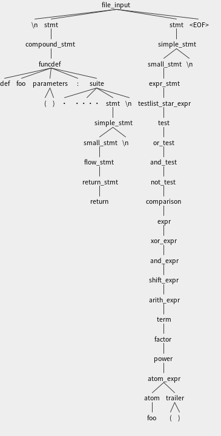

#! https://zhuanlan.zhihu.com/p/590399277
# 基于 antlr4 的 Python 解释器

该项目是上海交通大学致远学院 ACM 班的第三次程序设计大作业, 笔者通过助教的讲解与同学的帮助, 完成了 Python 解释器的核心代码.

大作业地址: https://github.com/ACMClassCourse-2022/Python-Interpreter-2022
实现方案: https://github.com/Conless/HW3-Python-Interpreter-2022

## 简介

Antlr (ANother Tool for Language Recognition) 是一个强大的跨语言语法解析器，可以用来读取, 处理, 执行或翻译结构化文本或二进制文件. 它被广泛用来构建语言, 工具和框架. Antlr 可以从语法上来生成一个可以构建和遍历解析树的解析器.

通过使用 antlr 对一个简单的 Python 程序进行句法语法分析, 可以得到一棵代码语法树, 如下图所示



该语法树对应的核心规则在 [Python3.g4](https://github.com/Conless/HW3-Python-Interpreter-2022/blob/main/generated/Python3.g4) 中给出.

随后需要完成的就是在 [Evalvisitor.h/.cpp](https://github.com/Conless/HW3-Python-Interpreter-2022/blob/main/src/Evalvisitor.cpp) 中完成对树上每一个节点的访问.

## 第三方库: antlrcpp::Any

Any 类型是 Python 解释器中十分关键的一环. 众所周知, Python 里面进行变量定义与赋值的时候并不需要指定类型, 函数的返回参数也并非给定的类型. 因此, 为了在 C++ 中进行实现, 我们有必要引入这个类以完成任意类型的判断, 其两个最重要的接口为:
```cpp
template <class U> bool is();

template<class U> const StorageType<U>& as();
```
前者可用于判断一个变量是否为某一类型的数据, 后者用于将变量转化为某一类型的数据. 其实现的基本原理是使用 dynamic_cast<>() 来对指针进行类型转化.

## 接口

以下内容是 [Evalvisitor.h](https://github.com/Conless/HW3-Python-Interpreter-2022/blob/main/include/pyinter/Evalvisitor.h) 中给出的, 需要逐一实现的接口

```cpp
class EvalVisitor : public Python3BaseVisitor {
  
  public:
    virtual antlrcpp::Any visitFuncdef(Python3Parser::FuncdefContext *ctx) override;
    
    virtual antlrcpp::Any visitParameters(Python3Parser::ParametersContext *ctx) override;
    
    virtual antlrcpp::Any visitExpr_stmt(Python3Parser::Expr_stmtContext *ctx) override;
    
    virtual antlrcpp::Any visitFlow_stmt(Python3Parser::Flow_stmtContext *ctx) override;
    
    virtual antlrcpp::Any visitIf_stmt(Python3Parser::If_stmtContext *ctx) override;
    
    virtual antlrcpp::Any visitWhile_stmt(Python3Parser::While_stmtContext *ctx) 
    override;
    
    virtual antlrcpp::Any visitSuite(Python3Parser::SuiteContext *ctx) override;
    
    virtual antlrcpp::Any visitOr_test(Python3Parser::Or_testContext *ctx) override;
    
    virtual antlrcpp::Any visitAnd_test(Python3Parser::And_testContext *ctx) override;
    
    virtual antlrcpp::Any visitNot_test(Python3Parser::Not_testContext *ctx) override;
    
    virtual antlrcpp::Any visitComparison(Python3Parser::ComparisonContext *ctx) override;
    
    virtual antlrcpp::Any visitArith_expr(Python3Parser::Arith_exprContext *ctx) override;
    
    virtual antlrcpp::Any visitTerm(Python3Parser::TermContext *ctx) override;
    
    virtual antlrcpp::Any visitFactor(Python3Parser::FactorContext *ctx) override;
    
    virtual antlrcpp::Any visitAtom_expr(Python3Parser::Atom_exprContext *ctx) override;
    
    virtual antlrcpp::Any visitTrailer(Python3Parser::TrailerContext *ctx) override;
    
    virtual antlrcpp::Any visitAtom(Python3Parser::AtomContext *ctx) override;
    
    virtual antlrcpp::Any visitTestlist(Python3Parser::TestlistContext *ctx) override;
    
    virtual antlrcpp::Any visitArglist(Python3Parser::ArglistContext *ctx) override;
    
    virtual antlrcpp::Any visitArgument(Python3Parser::ArgumentContext *ctx) override;
};
```

## 实现

### 基础功能: 赋值, 变量与基础运算

对变量赋值, 以及进行自算术运算的语句属于 expr_stmt, 在 Python3.g4 中的定义如下: 

```java
expr_stmt: testlist ( (augassign testlist) | ('=' testlist)*);
augassign: ('+=' | '-=' | '*=' | '/=' | '//=' | '%=' );
testlist: test (',' test)* (',')?; // 算式 eg: a,b a a+b
```
首先考虑对变量赋值. 在 Python 中, 对变量的定义是可以直接在赋值时完成的, 因此在此之前需要首先实现变量的操作. 如果只考虑全局变量的情况, 实现是简单的: 
```cpp
class Scope {
  private:
    std::unordered_map<std::string, antlrcpp::Any> data_table;
  public:
    std::pair<bool, antlrcpp::Any> VarQuery(std::string var_name);
    void VarRegister(std::string var_name, antlrcpp::Any var_data);
};
```
随后, 对于简单的赋值语句, 即 a = b 或类似操作, 我们只需要首先访问右值, 然后强制 VarRegister 即可:
```cpp
if (testlist_array.size() == 2) {
    std::string var_name = testlist_array[0]->getText();
    antlrcpp::Any num = visitTestlist(testlist_array[1]);
    // TODO
    var_table.VarRegister(var_name, num);
}
```
对于自算术运算同理:
```cpp
if (ctx->augassign()) {
    std::string opt = ctx->augassign()->getText();
    std::string var_name = testlist_array[0]->getText();
    auto var = var_table.VarQuery(var_name);
    auto num = visitTestlist(testlist_array[1]);
    if (!var.exist)
        throw Exception("", UNDEFINED);
    if (opt == "+=") {
        var_table.VarRegister(var_name, var.data + num);
    } else if (opt == "-=") {
        var_table.VarRegister(var_name, var.data - num);
    } else if (opt == "*=") {
        var_table.VarRegister(var_name, var.data * num);
    } else if (opt == "/=") {
        var_table.VarRegister(var_name, var.data / num);
    } else if (opt == "//=") {
        var_table.VarRegister(var_name, divide(var.data, num));
    }
    return var_table.VarQuery(var_name).data;
}
```

对变量进行算术运算的操作则在 arith_expr (+,-) 与 term (*,/,//,%) 中实现 (显然地, 后者是前者的子节点, 因为先乘除后加减), 在 Python3.g4 中可以找到对应的语法规范:
```java
arith_expr: term (addorsub_op term)*;
addorsub_op: '+'|'-';

term: factor (muldivmod_op factor)*;
muldivmod_op: '*'|'/'|'//'|'%';
```
与上述实现方式类同, 在此不再赘述.

### 简单功能: 判断, 循环, 逻辑语句

在 Python3.g4 中, 可以找到判断语句的基本组成结构:
```java
if_stmt: 'if' test ':' suite ('elif' test ':' suite)* ('else' ':' suite)?;
```
其中 test 是一个判断语句, suite 是一串操作语句. 这里的难点在于处理好 if-else 之间的关系, 注意到他们可以更加清晰地表示为
```
if (test1)
    suite1
elif (test2)
    suite2
else
    suite3
```
也即, 在最后一个 else 存在的情况下, 会且仅会执行一段 suite 语句, 其进入条件直接由对应编号相等的 test 语句进行控制, 这样一来, 就能写出相关内容的处理:
```cpp
auto test_array = ctx->test();              // The test array for if statement
auto suite_array = ctx->suite();            // The suite array
for (int i = 0; i < test_array.size(); i++) {
    if (Convert<bool>()(visitTest(test_array[i])))
        return visitSuite(suite_array[i]);
}
if (test_array.size() < suite_array.size()) // Else statement
    return visitSuite(suite_array.back());
return {};
```
对于 while 语句的处理也是同理, 这里需要特判的是循环语句的提前中断标志, 例如, continue, break 和 return, 可以考虑采用枚举类型
```cpp
enum FlowType { kFlowContinue, kFlowBreak, kFlowReturn};
```
于是对于 while 语句类型
```java
while_stmt: 'while' test ':' suite;
```
就可以直接使用 C++ 的 while 逻辑进行实现.
```cpp
auto test_expr = ctx->test();
auto suite_expr = ctx->suite();
while (Convert<bool>()(visitTest(test_expr))) {
    antlrcpp::Any ret = visitSuite(suite_expr);
    if (ret.is<FlowType>() && ret.as<FlowType>() == kFlowBreak)
        break;
    if (ret.is<std::pair<FlowType, antlrcpp::Any>>() && ret.as<std::pair<FlowType, antlrcpp::Any>>().first == kFlowReturn)
        return ret;
}
return {};
```
紧接着就是逻辑运算的实现 (当然, 这个也是上面的判断循环语句的前提), 语法结构按照 Python 中的操作顺序进行:
```java
or_test: and_test ('or' and_test)*;
and_test: not_test ('and' not_test)*;
not_test: 'not' not_test | comparison;
```
这里需要注意的是 and not 语句需要及时终端, 也即 and 逻辑中一错皆错, or 逻辑中一对皆对:
```cpp
// void visitOr_test(ctx)
for (int i = 0; i < or_array.size(); i++) {
    if (Convert<bool>()(visitAnd_test(or_array[i])))
        return true;
}
return false;
// void visitAnd_test(ctx):
for (int i = 0; i < not_array.size(); i++) {
    if (!Convert<bool>()(visitNot_test(not_array[i])))
        return false;
}
return true;
// void visitNot_test(ctx)
if (ctx->NOT())
    return !(Convert<bool>()(visitNot_test(ctx->not_test())));
```
至此就完成了一个极简 Python 代码 (无函数, 无列表, 无复杂类型) 的解释器.

### 进阶功能: 函数与局部变量

函数的实现和调试是笔者完成这一项目过程中耗时较多的一部分, 其难点在于递归调用与局部变量的处理, 在这里, 前面实现的 class Scope 就有必要更改了:
```cpp
class Scope {
    // std::unordered_map<std::string, antlrcpp::Any> data_table;
    std::vector<std::unordered_map<std::string, antlrcpp::Any>> data_table;
};
```
每进入一层函数, 就需要在 vector 中新建一维 unordered_map, 而在函数内进行参数访问的时候, 有可能出现: 访问局部变量, 访问全局变量, 局部变量和全局变量重名 这几种情况, 因此, 在 VarQuery 中需要实现访问优先级的判断:
```cpp
QueryResult Scope::VarQuery(const std::string &var_name) const {
    auto it = data_table.back().find(var_name);
    if (it == data_table.back().end()) {
        it = data_table.front().find(var_name);
        if (it == data_table.front().end())
            return QueryResult(false, 0);
    }
    return QueryResult(true, it->second);
}
```
于是就可以进行函数的定义, 根据 Python3.g4:
```java
funcdef: 'def' NAME parameters ':' suite;
parameters: '(' typedargslist? ')';
```
函数的定义由参数定义和语句定义两部分组成, 在定义环节, 首先注册函数的参数, 注意直接访问默认传参的右值
```cpp
int fir_init = tfpdef_array.size() - test_array.size();
for (int i = 0; i < tfpdef_array.size(); i++) {
    std::string var_name = tfpdef_array[i]->NAME()->getText();
    antlrcpp::Any var_data;
    if (i < fir_init)
        var_data = {};                                  // Default parameter as null
    else
        var_data = visitTest(test_array[i - fir_init]); // Visit Default test
    para_array_init.push_back(make_pair(var_name, var_data));
}
return para_array_init;
```
然后直接进行函数的定义, 不需要进行语句访问
```cpp
std::string func_name = ctx->NAME()->getText();
Function func_data({visitParameters(ctx->parameters()).as<std::vector<std::pair<std::string, antlrcpp::Any>>>(), ctx->suite()});
func_table.VarRegister(func_name, func_data);
return {};
```
函数的调用则是在 atom_expr 中进行的, 在每一次调用过程中, 对于基本的函数访问, 分为三个阶段进行:
1. 往栈中新压入一个哈希表, 注册函数参数.
2. 访问函数.
3. 注销函数参数与函数局部变量, 将栈顶弹出.
注册函数参数过程中, 则可以给每一个参数先赋予临时变量, 然后再用传入的数值对参数值进行 override.
```cpp
Function func_now = func_query.data;
var_table.push();
stk++;
for (int i = 0; i < func_now.para_array.size(); i++)
    var_table.VarRegister(func_now.para_array[i].first, func_now.para_array[i].second);
// TODO
for (int i = 0; i < argsArray.size(); i++)
    var_table.VarRegister(func_now.para_array[i].first, argsArray[i]);
antlrcpp::Any ret_value = visitSuite(func_now.suite_array);
stk--;
var_table.pop();
```

### Python 特性: Arglist, Keyword positioning

#### Arglist

在 Python 解释器的实现过程中, 也学到了一些 Python 中~~很难实现~~独具的特性, 在这里挑两个进行简单介绍:

首先是稍微容易实现的 Arglist, 参考 Python3.g4 的定义:
```java
arglist: argument (',' argument)*  (',')?;
```
也就是说, 会有类似
```python
a, b = 1, 2
a, b = func()
```

于是需要注意在赋值语句, 函数返回语句等处注意遇到 arglist 时需要用 vector 传参.

#### Keyword positioning

这是一个令人实现起来非常头大的功能, 举个栗子: 对于函数
```python
def func(a, b, c = f(1), d = g(1))
```
我们可以考虑调用方式
```python
func(1, 2, 3)
func(a = 1, 2)
func(c = 1, 2, a = 3)
```
也即, 可以在调用时单独对参数进行赋值. 但是因为在笔者的实现方式中, 访问一个 test 的返回值是原始数据, 而非像 [@hastin](https://github.com/zsq259/Python-Interpreter-2022) 等巨佬一样早早发现应该返回
```cpp
std::pair<std::string(var_name), antlrcpp::Any(var_data)>
```
导致在处理这个的时候做的非常麻烦, 在此不做展开

## 一些总结

该项目的实现最大难点在于正确使用每个第三方库接口, 以及看懂 Python3.g4 里面给出的语法规则. 后面在调试的时候遇到的问题有:
1. 没有搞懂有些语法细节, 比如 keyword positioning 和 default value 的混合使用.
2. 在类型转化的时候出现了不少问题, 最后改为使用模板类特化的方式进行了实现.
```cpp
template <class T> class Convert {
  public:
    T operator()(const antlrcpp::Any &num);
};
template <> class Convert<ll>;
template <> class Convert<double>;
template <> class Convert<bool>;
template <> class Convert<std::string>;
```
